# Diagramas de Casos de Uso

## Módulo 1: Autenticación

```mermaid
graph TD
    User([Usuario Freelancer])
    
    User --> UC01[UC-AUTH-01: Registrarse]
    User --> UC02[UC-AUTH-02: Iniciar sesión]
    User --> UC03[UC-AUTH-03: Cerrar sesión]
    User --> UC04[UC-AUTH-04: Recuperar contraseña]
    
    UC01 --> Supabase[(Supabase Auth)]
    UC02 --> Supabase
    UC03 --> Supabase
    UC04 --> Supabase
    
    UC01 --> CreateSettings[Crear user_settings]
    CreateSettings --> DB[(PostgreSQL)]
```



## Módulo 2: Clientes


## Módulo 3: Proyectos

```mermaid
graph TD
    User([Usuario Freelancer])
    
    User --> UC21[UC-PROJECT-01: Crear proyecto]
    User --> UC22[UC-PROJECT-02: Editar proyecto]
    User --> UC23[UC-PROJECT-03: Ver lista proyectos]
    User --> UC24[UC-PROJECT-04: Archivar proyecto]
    
    UC21 --> SelectClient[Seleccionar cliente]
    SelectClient --> DB[(PostgreSQL)]
    
    UC22 --> DB
    UC23 --> FilterByClient[Filtrar por cliente]
    FilterByClient --> DB
    
    UC24 --> ArchiveCheck{¿Tiene actividades activas?}
    ArchiveCheck -->|Sí| ShowWarning[Mostrar advertencia]
    ArchiveCheck -->|No| Archive[Marcar is_archived = true]
    Archive --> DB
```



## Módulo 4: Tarifas


## Módulo 5: Actividades y Kanban

```mermaid
graph TD
    User([Usuario Freelancer])
    
    User --> UC41[UC-ACTIVITY-01: Crear actividad]
    User --> UC42[UC-ACTIVITY-02: Editar actividad]
    User --> UC43[UC-ACTIVITY-03: Cambiar estado drag & drop]
    User --> UC44[UC-ACTIVITY-04: Loggear tiempo]
    User --> UC45[UC-ACTIVITY-05: Adjuntar archivos]
    User --> UC46[UC-ACTIVITY-06: Ver detalle]
    User --> UC47[UC-ACTIVITY-07: Eliminar actividad]
    
    UC41 --> SelectClient[Seleccionar cliente]
    SelectClient --> SelectProject[Seleccionar proyecto]
    SelectProject --> SelectService[Seleccionar tipo servicio]
    SelectService --> GetRate{¿Existe tarifa?}
    GetRate -->|Específica| UseSpecificRate[Usar tarifa cliente]
    GetRate -->|Base| UseBaseRate[Usar tarifa base]
    GetRate -->|No existe| ManualRate[Ingresar manualmente]
    UseSpecificRate --> CreateActivity[Crear en estado 'por_validar']
    UseBaseRate --> CreateActivity
    ManualRate --> CreateActivity
    CreateActivity --> DB[(PostgreSQL)]
    
    UC43 --> DragCard[Drag tarjeta a nueva columna]
    DragCard --> ValidateTransition{¿Transición válida?}
    ValidateTransition -->|Sí| UpdateStatus[Actualizar status]
    ValidateTransition -->|No| ShowError[Mostrar error]
    UpdateStatus --> RealtimeUpdate[Broadcast Realtime]
    RealtimeUpdate --> Supabase[(Supabase Realtime)]
    UpdateStatus --> DB
    
    UC44 --> ChooseMethod{Método}
    ChooseMethod -->|Timer| StartTimer[Iniciar timer]
    ChooseMethod -->|Manual| ManualEntry[Entrada manual]
    StartTimer --> StoreInZustand[Guardar en timerStore]
    StartTimer --> StopTimer[Detener timer]
    StopTimer --> CreateTimeEntry[Crear time_entry]
    ManualEntry --> CreateTimeEntry
    CreateTimeEntry --> CalcDuration[Trigger calcula duration_minutes]
    CalcDuration --> DB
    
    UC45 --> UploadFile[Upload archivo]
    UploadFile --> ValidateSize{¿< 10MB?}
    ValidateSize -->|Sí| ValidateType{¿Tipo permitido?}
    ValidateSize -->|No| ShowSizeError[Error tamaño]
    ValidateType -->|Sí| UploadToStorage[Upload Supabase Storage]
    ValidateType -->|No| ShowTypeError[Error tipo]
    UploadToStorage --> CreateAttachment[Crear activity_attachment]
    CreateAttachment --> DB
```



## Módulo 6: Facturas

```mermaid
graph TD
    User([Usuario Freelancer])
    
    User --> UC51[UC-INVOICE-01: Crear factura]
    User --> UC52[UC-INVOICE-02: Agregar ítem manual]
    User --> UC53[UC-INVOICE-03: Aplicar descuento]
    User --> UC54[UC-INVOICE-04: Cambiar estado]
    User --> UC55[UC-INVOICE-05: Generar PDF]
    User --> UC56[UC-INVOICE-06: Enviar email]
    User --> UC57[UC-INVOICE-07: Marcar como pagada]
    
    UC51 --> SelectClient[Seleccionar cliente]
    SelectClient --> GetActivities[Obtener actividades 'por_facturar']
    GetActivities --> SelectActivities[Seleccionar actividades]
    SelectActivities --> CalcFromActivities[Calcular montos]
    CalcFromActivities --> CreateInvoiceDraft[Crear factura 'borrador']
    CreateInvoiceDraft --> DB[(PostgreSQL)]
    
    UC52 --> AddManualItem[Agregar invoice_item manual]
    AddManualItem --> RecalcTotal[Recalcular total]
    RecalcTotal --> DB
    
    UC53 --> ChooseDiscount{Tipo descuento}
    ChooseDiscount -->|Porcentaje| ApplyPercent[Aplicar %]
    ChooseDiscount -->|Monto fijo| ApplyFixed[Aplicar monto]
    ApplyPercent --> RecalcTotal2[Recalcular total]
    ApplyFixed --> RecalcTotal2
    RecalcTotal2 --> DB
    
    UC54 --> ChangeStatus{Nuevo estado}
    ChangeStatus -->|En espera pago| GenerateNumber[Generar invoice_number]
    ChangeStatus -->|Pagada| SetPaidDate[Establecer paid_date]
    ChangeStatus -->|Anulada| MarkCancelled[Marcar anulada]
    GenerateNumber --> TriggerFunc[Trigger genera YYYY-NNNN]
    TriggerFunc --> DB
    SetPaidDate --> DB
    MarkCancelled --> DB
    
    UC55 --> GeneratePDF[@react-pdf/renderer]
    GeneratePDF --> IncludeLegalMentions[Incluir menciones legales]
    IncludeLegalMentions --> UploadPDF[Upload a Supabase Storage]
    UploadPDF --> SavePath[Guardar pdf_path]
    SavePath --> DB
    
    UC57 --> SetPaid[status = 'pagada']
    SetPaid --> SetDate[paid_date = NOW]
    SetDate --> UpdateActivities[Actualizar actividades a 'facturada']
    UpdateActivities --> DB
```

## Módulo 7: Dashboard y URSSAF

```mermaid
graph TD
    User([Usuario Freelancer])
    
    User --> UC61[UC-URSSAF-01: Ver CA mensual]
    User --> UC62[UC-URSSAF-02: Ver CA anual]
    User --> UC63[UC-URSSAF-03: Calcular cotizaciones]
    User --> UC64[UC-URSSAF-04: Ver alertas]
    
    UC61 --> QueryMonthly[SELECT monthly_revenue_summary]
    QueryMonthly --> FilterPaid[WHERE status = 'pagada']
    FilterPaid --> DB[(PostgreSQL)]
    DB --> DisplayCA[Mostrar CA mes]
    
    UC62 --> QueryAnnual[SELECT annual_revenue_summary]
    QueryAnnual --> CalcAccum[Acumular por año]
    CalcAccum --> DB
    DB --> DisplayAnnual[Mostrar CA año]
    DisplayAnnual --> CalcPercent[Calcular % vs plafond]
    CalcPercent --> Display77700[Mostrar 77.700€ plafond]
    
    UC63 --> GetMonthlyCA[Obtener CA mensual pagado]
    GetMonthlyCA --> CalcCotisations[CA * 24.6%]
    CalcCotisations --> DisplayCotis[Mostrar cotizaciones]
    
    UC64 --> CheckThresholds{Verificar umbrales}
    CheckThresholds -->|CA > 37.500€| AlertTVA[🚨 Alerta TVA]
    CheckThresholds -->|CA > 77.700€| AlertPlafond[🚨 Plafond dépassé]
    CheckThresholds -->|CA > 69.930€| WarningPlafond[⚠️ Acercándose plafond]
    AlertTVA --> Display
    AlertPlafond --> Display
    WarningPlafond --> Display
```



## Módulo 8: Reportes por Cliente

```mermaid
graph TD
    User([Usuario Freelancer])
    
    User --> UC71[UC-REPORT-01: Ver resumen cliente]
    User --> UC72[UC-REPORT-02: Exportar PDF]
    User --> UC73[UC-REPORT-03: Ver histórico facturación]
    
    UC71 --> SelectClient[Seleccionar cliente]
    SelectClient --> GetProjects[Obtener proyectos]
    SelectClient --> GetActivities[Obtener actividades]
    SelectClient --> GetInvoices[Obtener facturas]
    SelectClient --> GetTimeEntries[Obtener time_entries]
    
    GetProjects --> DB[(PostgreSQL)]
    GetActivities --> DB
    GetInvoices --> DB
    GetTimeEntries --> DB
    
    DB --> CalcStats[Calcular estadísticas]
    CalcStats --> TotalCA[Total CA generado]
    CalcStats --> TotalHours[Total horas trabajadas]
    CalcStats --> AvgRate[Tarifa promedio]
    CalcStats --> InvoicesPaid[Facturas pagadas]
    CalcStats --> InvoicesPending[Facturas pendientes]
    
    TotalCA --> DisplayReport[Mostrar reporte]
    TotalHours --> DisplayReport
    AvgRate --> DisplayReport
    InvoicesPaid --> DisplayReport
    InvoicesPending --> DisplayReport
    
    UC72 --> GenerateReportPDF[@react-pdf/renderer]
    GenerateReportPDF --> IncludeTables[Incluir tablas detalladas]
    IncludeTables --> DownloadPDF[Descargar PDF]
    
    UC73 --> FilterByPeriod[Filtrar por período]
    FilterByPeriod --> GroupByMonth[Agrupar por mes]
    GroupByMonth --> ShowChart[Mostrar gráfico evolución]
```

## Flujo Completo: Workflow de Actividad


## Flujo Completo: Ciclo de Facturación

```mermaid
sequenceDiagram
    participant U as Usuario
    participant UI as Interface
    participant API as Supabase API
    participant DB as PostgreSQL
    participant PDF as PDF Generator
    participant Storage as Supabase Storage
    
    U->>UI: Crear nueva factura
    UI->>U: Seleccionar cliente
    U->>UI: Cliente seleccionado
    
    UI->>API: GET /activities?client_id&status=por_facturar
    API->>DB: SELECT activities
    DB-->>API: Actividades
    API-->>UI: Lista actividades
    
    UI->>U: Mostrar actividades disponibles
    U->>UI: Seleccionar actividades
    
    UI->>UI: Calcular totales
    Note over UI: Suma horas * tarifas
    
    U->>UI: Aplicar descuento (opcional)
    UI->>UI: Recalcular total
    
    U->>UI: Guardar borrador
    UI->>API: POST /invoices
    API->>DB: INSERT invoice (status=borrador)
    DB-->>API: Invoice creada
    API->>DB: INSERT invoice_items
    DB-->>API: Items creados
    API-->>UI: Confirmación
    
    Note over U,UI: Usuario revisa y edita
    
    U->>UI: Generar factura
    UI->>API: PATCH /invoices/:id (status=en_espera_pago)
    API->>DB: UPDATE invoice
    DB->>DB: Trigger genera invoice_number
    DB-->>API: Factura actualizada
    
    UI->>PDF: Generar PDF
    PDF->>PDF: Crear documento con @react-pdf
    PDF-->>UI: PDF blob
    
    UI->>Storage: Upload PDF
    Storage-->>UI: URL PDF
    
    UI->>API: PATCH /invoices/:id (pdf_path)
    API->>DB: UPDATE pdf_path
    DB-->>API: Confirmación
    
    API-->>UI: Factura completa
    UI->>U: Mostrar PDF + link descarga
    
    Note over U: Usuario envía al cliente
    
    Note over U: Cliente paga
    
    U->>UI: Marcar como pagada
    UI->>API: PATCH /invoices/:id
    API->>DB: UPDATE status=pagada, paid_date=NOW()
    DB-->>API: Confirmación
    
    API->>DB: UPDATE activities status=facturada
    DB-->>API: Actividades actualizadas
    
    API-->>UI: Éxito
    UI->>U: Confirmación
```



## Arquitectura de Datos: Relaciones


